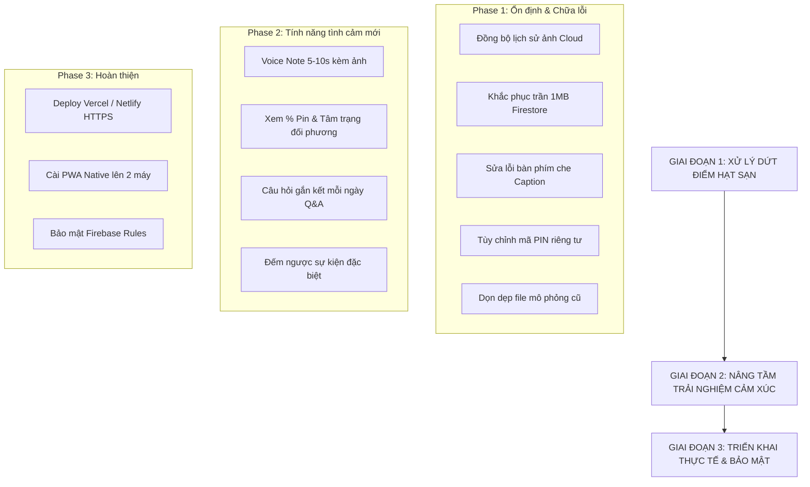

# 📋 KẾ HOẠCH TỔNG THỂ: XỬ LÝ HẠT SẠN & PHÁT TRIỂN COUPLE APP
> **Phiên bản:** 2.0 • **Mục tiêu:** Hoàn thiện ứng dụng cặp đôi Locket & Habi chuẩn Native PWA, bảo mật, không lỗi, 0 VNĐ trọn đời.

---

## 🧭 TỔNG QUAN LỘ TRÌNH (3 GIAI ĐOẠN)

---

## 🛠️ GIAI ĐOẠN 1: XỬ LÝ TRIỆT ĐỂ CÁC "HẠT SẠN" CỐT LÕI (ƯU TIÊN CAO NHẤT)

### 1. Đồng bộ lịch sử ảnh trên Firebase Cloud (Khắc phục hạt sạn #1)
- **Vấn đề hiện tại:** Khi Bạn Trai gửi ảnh mà Bạn Gái đang tắt app, Bạn Gái chỉ nhận được tấm ảnh cuối cùng. Toàn bộ ảnh trước đó bị mất khỏi cuộn phim của Bạn Gái.
- **Giải pháp:**
  - Tạo subcollection `couples/{coupleId}/photos` trên Cloud Firestore.
  - Khi bất kỳ ai chụp ảnh ➔ Ảnh vừa lưu vào IndexedDB máy mình, vừa lưu thành 1 document trong `photos`.
  - Khi mở app ➔ Tự động đối soát và tải về tất cả các bức ảnh còn thiếu về IndexedDB của máy đối phương.
- **Kết quả:** Đảm bảo **cuộn phim kỷ niệm của 2 máy luôn giống hệt nhau 100%**, dù tắt app cả tuần hay đổi sang điện thoại mới vẫn không mất 1 tấm ảnh nào.

### 2. Tối ưu nén ảnh & Chống tràn giới hạn 1MB Firestore (Khắc phục hạt sạn #2)
- **Vấn đề hiện tại:** Chuỗi Base64 nếu vượt 1MB sẽ bị Firestore từ chối ghi (`Document exceeds maximum size`), dẫn đến việc bấm gửi nhưng máy kia không nhận được.
- **Giải pháp:**
  - Tối ưu bộ giải thuật nén ảnh tự động trong `src/services/compressor.js`: cưỡng bức dung lượng Base64 sau khi nén luôn nằm trong khoảng **120KB - 250KB** (vừa sắc nét cho màn hình điện thoại, vừa chỉ chiếm 1/5 giới hạn của Google).
  - Tích hợp thêm Firebase Storage dự phòng khi người dùng muốn lưu ảnh gốc siêu nét.

### 3. Khắc phục bàn phím ảo che mất Caption trên điện thoại (Khắc phục hạt sạn #5)
- **Vấn đề hiện tại:** Khi bấm vào ô "Gửi một tin nhắn..." trên iPhone/Android, bàn phím ảo bật lên che mất ô nhập và nút gửi.
- **Giải pháp:**
  - Lắng nghe sự kiện `window.visualViewport.resize`.
  - Tự động đẩy modal chụp ảnh và thanh caption lên phía trên bàn phím ảo mượt mà theo chuẩn iOS Keyboard Accessory View.

### 4. Tùy chỉnh mã PIN 4 số riêng biệt (Khắc phục hạt sạn #4)
- **Vấn đề hiện tại:** Mã vào app đang bị cố định `00` và `01`, ai có link cũng vào xem được.
- **Giải pháp:**
  - Cho phép 2 bạn tự đặt **Mã PIN bí mật 4 số** (ví dụ: ngày kỷ niệm `2004` hoặc năm sinh).
  - Thêm tính năng "Ghi nhớ đăng nhập trên máy này" (nhập 1 lần duy nhất, lần sau mở app vào thẳng).

### 5. Xử lý mở link trong Zalo / Facebook Messenger (Khắc phục hạt sạn #6)
- **Vấn đề hiện tại:** Nếu gửi link qua Zalo/Facebook và người yêu bấm mở ngay trong khung chat, camera sẽ bị đen do trình duyệt nhúng chặn WebRTC.
- **Giải pháp:**
  - Thêm màn hình hướng dẫn thông minh: Nếu phát hiện đang mở trong Zalo/Messenger/TikTok ➔ Hiện nút *"Mở bằng Safari / Chrome"* để camera hoạt động 100%.

### 6. Dọn dẹp mã nguồn thừa (Khắc phục hạt sạn #8)
- Xóa file mô phỏng cũ `may_a.html` để mã nguồn sạch sẽ, thống nhất 100% vào ứng dụng React chuẩn trong `src/`.

---

## 💖 GIAI ĐOẠN 2: NÂNG TẦM TRẢI NGHIỆM CẢM XÚC (TÍNH NĂNG MỚI)

### 1. Voice Note Locket (Ghi âm giọng nói 5-10s kèm ảnh)
- **Cách hoạt động:** Khi xem ảnh vừa chụp, bạn có thể nhấn giữ icon Micro 🎙️ để thu âm 1 câu nói ngắn (ví dụ: *"Chúc ngủ ngon", "Nhớ em nhiều"*).
- **Trải nghiệm:** Khi người yêu mở ảnh Locket, giọng nói của bạn sẽ tự động phát kèm theo hiệu ứng sóng âm thanh sống động.

### 2. Live Widget: % Pin & Tâm trạng nhanh của đối phương
- **Cách hoạt động:** 
  - Tự động cập nhật mức % pin của điện thoại đối phương (thông qua Battery API).
  - Thanh trạng thái nhanh: *"Đang học bài 📚"*, *"Đang ăn cơm 🍜"*, *"Sắp ngủ 💤"*, *"Đang nhớ bạn ❤️"*.
- **Ý nghĩa:** Không cần nhắn tin hỏi *"Em đang làm gì?", "Máy em sắp hết pin chưa?"*, chỉ cần mở app là thấy ngay.

### 3. Câu hỏi gắn kết mỗi ngày (Daily Couple Q&A)
- **Cách hoạt động:**
  - Mỗi ngày vào lúc 9h sáng, app đưa ra 1 câu hỏi ngẫu nhiên cho 2 bạn (ví dụ: *"Món ăn đầu tiên 2 đứa đi ăn cùng nhau là gì?", "Điều làm bạn thấy người ấy đáng yêu nhất?"*).
  - Cả 2 cùng gõ câu trả lời. **Chỉ khi cả 2 người đã trả lời xong**, đáp án của nhau mới được mở khóa cùng lúc!

### 4. Đếm ngược cột mốc đặc biệt (Milestone Countdown)
- Đếm ngược đến sinh nhật của Bạn và Người yêu, ngày kỷ niệm 100 ngày, 1 năm, 1000 ngày kèm hiệu ứng pháo hoa giấy (confetti) chúc mừng khi đến ngày.

---

## 🚀 GIAI ĐOẠN 3: TRIỂN KHAI THỰC TẾ & BẢO MẬT (PRODUCTION READY)

### 1. Triển khai Hosting miễn phí có chứng chỉ HTTPS (Vercel / Netlify)
- Chỉ mất 1 lệnh deploy hoặc kết nối thẳng với kho lưu trữ GitHub hiện tại.
- Có ngay tên miền dạng `https://couple-love-tenban.vercel.app` bảo mật chuẩn HTTPS (bắt buộc để camera và tính năng PWA hoạt động trên điện thoại).

### 2. Thiết lập quy tắc bảo mật Cloud Firestore (Security Rules)
- Chuyển từ "Test Mode" sang bộ quy tắc chỉ cho phép thiết bị của 2 bạn đọc/ghi dữ liệu, ngăn chặn người lạ can thiệp.

### 3. Cài đặt chuẩn Native PWA lên iPhone & Android
- Thêm vào Màn hình chính (Add to Home Screen) thành một ứng dụng độc lập, tràn viền màn hình, có icon trái tim riêng trên điện thoại của hai bạn.

---

## ⏱️ BẢNG TIẾN ĐỘ THỰC HIỆN DỰ KIẾN

| Hạng mục công việc | Độ ưu tiên | Thời gian hoàn thành | Trạng thái |
| :--- | :---: | :---: | :---: |
| **Giai đoạn 1: Fix toàn bộ hạt sạn & Lưu ảnh Cloud & Font tiếng Việt** | 🔥 Khẩn cấp | 1 - 2 phiên làm việc | **✅ ĐÃ HOÀN THÀNH (100%)** |
| **Giai đoạn 2: Voice Note Locket 5s & Live % Pin đối phương** | ⭐ Rất cao | 1 phiên làm việc | **✅ ĐÃ HOÀN THÀNH (100%)** |
| **Giai đoạn 3: Deploy Vercel/Netlify HTTPS & Cài đặt 2 máy PWA** | 🚀 Hoàn thiện | 15 - 30 phút | **Sẵn sàng triển khai** |
